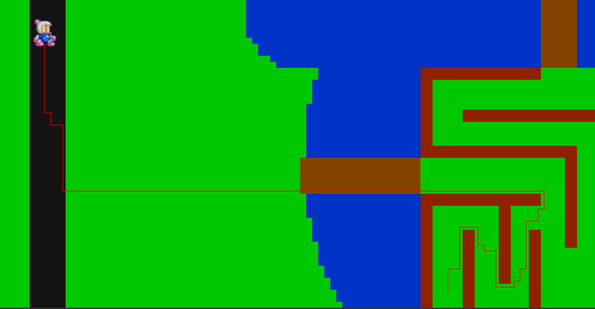
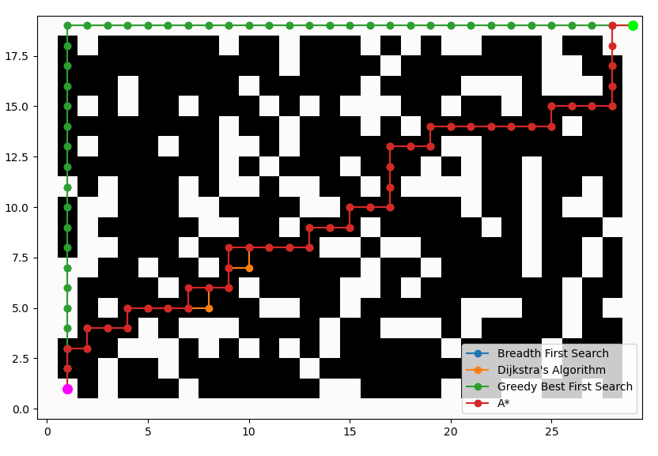

# Pathfinding demo



This is a demo of pathfinding on a 2D grid. It consists of 2 main parts:

* python notes and implementation
    * jupyter notebook file
    * standalone python script
* C++ interactive demo

## Python



### Standalone script

Run `python pathfinding_demo.py`. Requires numpy and matplotlib to be installed.

### Jupyter notebook

Contains the same demo as the standalone script and some notes. Since Github supports Jupyter Notebooks now, you can go [directly to the file](./python/pathfinding_demo.ipynb).

## C++

### Windows

#### Dependencies

* `vcpkg` needs to be installed and `VCPKG_ROOT` set. See the [installation instructions](https://learn.microsoft.com/en-us/vcpkg/get_started/get-started?pivots=shell-powershell).
* Visual Studio with Desktop development with C++ workload (or MSVC Build Tools)

#### Build

Run "Developer Command Prompt for VS 20xx":

```cmd
cmake --preset=vcpkg
cmake --build build
```

Run the `pathfinding.exe` binary in the `build` folder.

### Linux

#### Dependencies

* SDL3
* SDL3-image
* GLEW
* gtest

e.g. on Archlinux:

```
pacman -S glew sdl3 sdl3_image gtest
```

Optional dependencies for generating class and include diagrams:

* plantuml
* [clang-uml](https://github.com/bkryza/clang-uml)

clang-uml needs to be either installed from [AUR](https://aur.archlinux.org/packages/clang-uml) or built manually 

#### Build

```bash
cmake -B build
cmake --build build -j 16
```

Optionally you can also use options:

* `-DCMAKE_EXPORT_COMPILE_COMMANDS=ON` to enable compile database export (needed for class diagram generation)
* `-DCMAKE_C_COMPILER=clang -DCMAKE_CXX_COMPILER=clang++` to use clang

```
cmake -B build -DCMAKE_EXPORT_COMPILE_COMMANDS=O  -DCMAKE_C_COMPILER=clang -DCMAKE_CXX_COMPILER=clang++
```

Run the `pathfinding` binary in the `build` folder.

#### Generate architecture diagrams

Build with `-DCMAKE_EXPORT_COMPILE_COMMANDS=ON`. Then in the root folder run:

```
clang-uml
plantuml -tsvg docs/diagrams/*.puml
```

The resulting svg files are located in [docs/diagrams/](./docs/diagrams/). 
